<div align="center" style="margin-bottom:1.5rem;">
  
  <h1 style="font-size:2.2rem; font-weight:700; color:#222; margin:0;">SPPU Engineers Platform</h1>
</div>

> Source code is private. This repository documents system architecture, workflows, and implementation details.

---

## Introduction

SPPU Engineers is a unified digital platform serving SPPU students across Maharashtra. The system provides centralized access to academic materials, opportunity tracking, and automated resource management through a single dashboard. The platform handles authentication, payment processing, resource access control, and real-time notifications — all backed by Firebase services and deployed backend infrastructure.

Students access notes, PYQs, and master solutions; browse jobs and events; use academic calculators; and receive instant updates. Admins manage content, users, and analytics through a role-protected dashboard. The system automates everything from payment verification to Google Drive access provisioning.

This system handles real transactions, user data, and automated access workflows in production.

---

## Achievements & Impact

<table align="center" style="margin:0; padding:0; width:100%; table-layout:fixed; border-collapse: separate; border-spacing: 0;">
  <tr>
    <td align="center" style="padding:1.2rem 0; border:1px solid #444; width:20%;"><br/><span style="font-size:1.18rem;">10,000+<br/>students served</span></td>
    <td align="center" style="padding:1.2rem 0; border:1px solid #444; width:20%;"><br/><span style="font-size:1.18rem;">50,000+<br/>organic visits</span></td>
    <td align="center" style="padding:1.2rem 0; border:1px solid #444; width:20%;"><br/><span style="font-size:1.18rem;">1.5M+<br/>Google impressions</span></td>
    <td align="center" style="padding:1.2rem 0; border:1px solid #444; width:20%;"><br/><span style="font-size:1.18rem;">₹1.5L+<br/>revenue generated</span></td>
    <td align="center" style="padding:1.2rem 0; border:1px solid #444; width:20%;"><br/><span style="font-size:1.18rem;">Used across<br/>multiple colleges</span></td>
  </tr>
</table>

---

## Problem Statement

SPPU students face fragmented resource distribution and manual access workflows.

<table align="center" style="margin:1.2rem 0; min-width:340px;">
  <tr>
    <th style="background:#ffebee; color:#b71c1c; text-align:left; padding:0.7rem 1.2rem;">Problems</th>
    <th style="background:#e8f5e9; color:#1b5e20; text-align:left; padding:0.7rem 1.2rem;">Solutions</th>
  </tr>
  <tr>
    <td style="padding:0.7rem 1.2rem;">Notes scattered across chat groups</td>
    <td style="padding:0.7rem 1.2rem;">Centralized resource hub with search</td>
  </tr>
  <tr>
    <td style="padding:0.7rem 1.2rem;">No version control or authenticity checks</td>
    <td style="padding:0.7rem 1.2rem;">All content mapped to verified Google Drive sources</td>
  </tr>
  <tr>
    <td style="padding:0.7rem 1.2rem;">Manual payment verification and file sharing</td>
    <td style="padding:0.7rem 1.2rem;">Automated payment → access provisioning pipeline</td>
  </tr>
  <tr>
    <td style="padding:0.7rem 1.2rem;">No access tracking or audit logs</td>
    <td style="padding:0.7rem 1.2rem;">Role-based access control with full audit trails</td>
  </tr>
  <tr>
    <td style="padding:0.7rem 1.2rem;">Missed opportunities and updates</td>
    <td style="padding:0.7rem 1.2rem;">Real-time notifications and centralized tracking</td>
  </tr>
  <tr>
    <td style="padding:0.7rem 1.2rem;">Admin bottlenecks at scale</td>
    <td style="padding:0.7rem 1.2rem;">Admin dashboard with analytics and bulk operations</td>
  </tr>
</table>

The platform eliminates these inefficiencies through centralized access control, automated workflows, and real-time synchronization.

---

## Product Walkthrough

### 1. Home Page
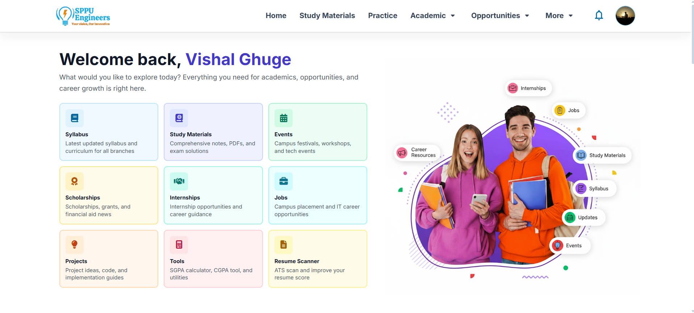

Landing page for SPPU Engineers. Users see featured resources, and navigation to all modules (notes, PYQs, internships, tools, etc). SEO-optimized, fast-loading, and mobile-friendly.

---

### 2. Events
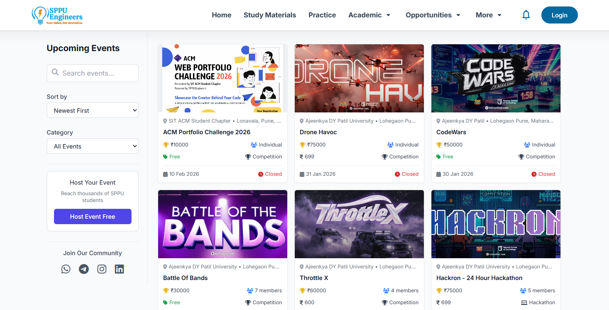

Browse all current SPPU events, hackathons, workshops, and competitions. Search, filter, and register for events. Data is fetched from Firestore and rendered instantly.

```js
// Frontend: Fetch and render events
const eventsSnap = await db.collection("events").orderBy("date", "desc").get();
const events = eventsSnap.docs.map(doc => doc.data());
events.forEach(event => renderEventCard(event));
```

---

### 3. Opportunities
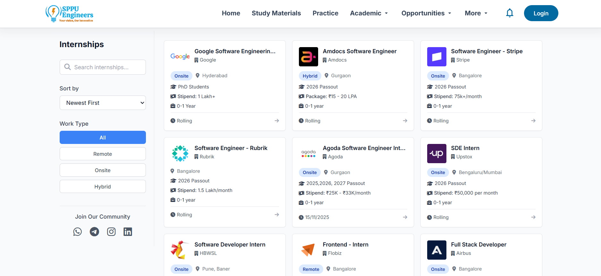

Find internships, jobs, and scholarships. Search, filter, and apply directly. Data is fetched from Firestore and cached for speed.

```js
// Frontend: Cached opportunities fetch
const oppSnap = await db.collection("opportunities")
  .orderBy("addedDate", "desc")
  .limit(100)
  .get();
const opportunities = oppSnap.docs.map(doc => doc.data());
opportunities.forEach(opp => renderOpportunityCard(opp));
```

---

### 4. Study Materials Hub
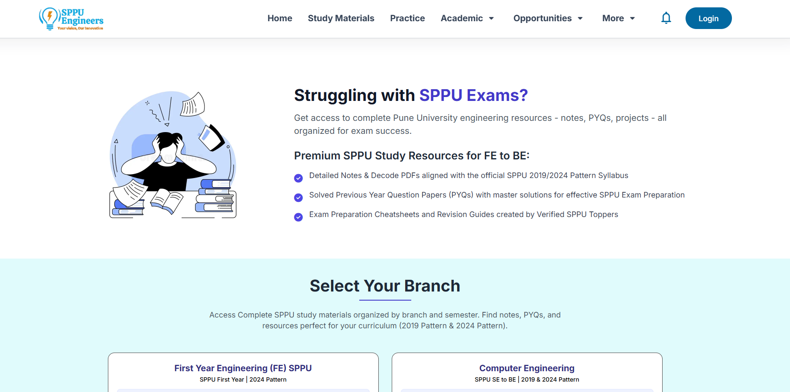

Branch-wise and semester-wise study materials, notes, and PYQs. Each resource is mapped to a Google Drive folder, and access is granted via Apps Script after payment. Users preview free content and can purchase full access.

---

### 5. Subjects Page
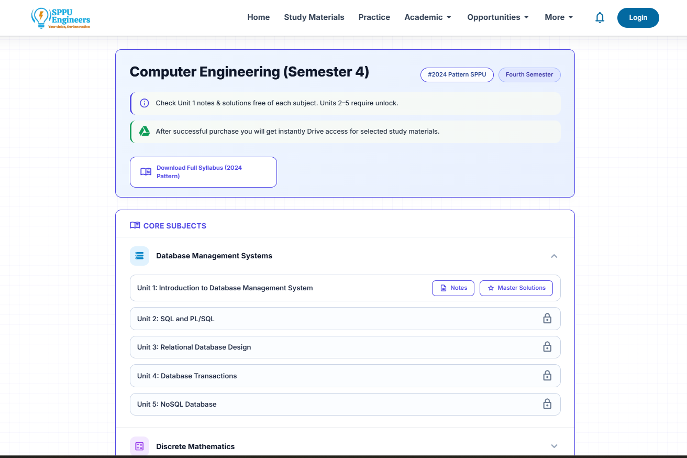

See all available notes, PYQs, and solutions for a specific subject. Access is shown based on your purchase status.

---

### 6. Semester Pack Selection
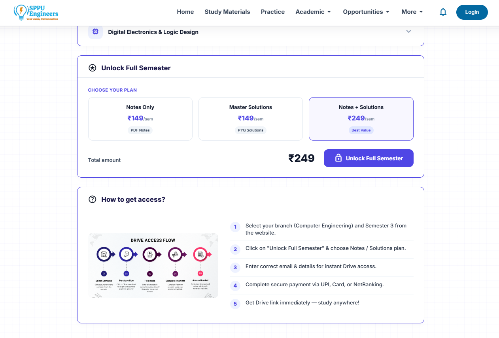

Choose your semester pack. Each pack is linked to a Google Drive folder, and access is granted via Apps Script after payment. Pricing and included resources are shown.

---

### 7. Secure Payment Checkout
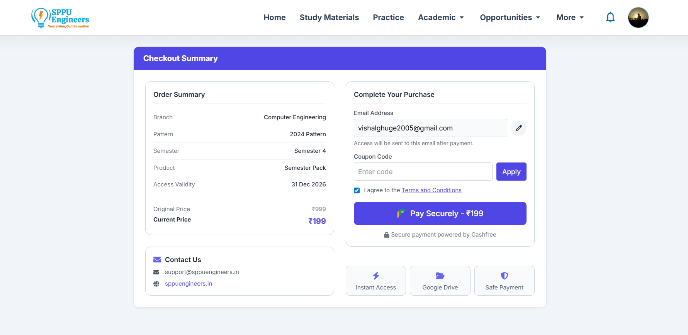

Complete payment via Cashfree. Coupon codes are validated, order is created, and payment is processed securely.

```js
// Backend: Create order
const res = await fetch("https://api.sppuengineers.in/createOrder", {
  method: "POST",
  headers: { "Content-Type": "application/json" },
  body: JSON.stringify({ packId, couponCode })
});
const { orderId } = await res.json();
// Redirect to Cashfree payment page
```

```js
// Frontend: Coupon validation
async function validateCouponFromCollection(rawCode) {
  const snap = await getDoc(doc(pricingDb, "coupons", code));
  if (!snap.exists()) return { valid: false, errorCode: "NOT_FOUND" };
  // Validate usage limits, expiration, and applicability
}
```

---

### 8. Payment Webhook Handler

When payment is completed, Cashfree sends a webhook to `/api/webhook/cashfree`. The backend processes payment, updates Firestore, and ensures idempotency using transactions.

```js
// Backend: Webhook handler with transaction
if (paymentStatus === "SUCCESS") {
  await db.runTransaction(async (tx) => {
    const paymentSnap = await tx.get(paymentRef);
    if (paymentSnap.exists() && paymentSnap.data().status === "SUCCESS") {
      // Already processed - skip to prevent duplicates
      return;
    }
    // Atomic updates: payment, enrollment, stats, user, coupon
    tx.set(paymentRef, paymentData);
    tx.set(enrollmentRef, enrollmentData);
    tx.update(statsRef, { totalOrders: FieldValue.increment(1) });
    tx.update(userRef, { enrollments: FieldValue.arrayUnion(packId) });
    if (couponCode) tx.update(couponRef, { usedCount: FieldValue.increment(1) });
  });
}
```

---

### 9. Google Drive Access Automation
After payment verification, a second webhook triggers Google Apps Script to grant Drive access. This separation ensures database consistency before external API calls. Apps Script checks for duplicate access and logs all actions.

```js
// Backend: Trigger Apps Script for Drive access
async function triggerAccessScript(email, semester) {
  await fetch(process.env.APPS_SCRIPT_URL, {
    method: "POST",
    headers: { "Content-Type": "application/json" },
    body: JSON.stringify({ email, semester })
  });
}
```

---

### 10. User Dashboard
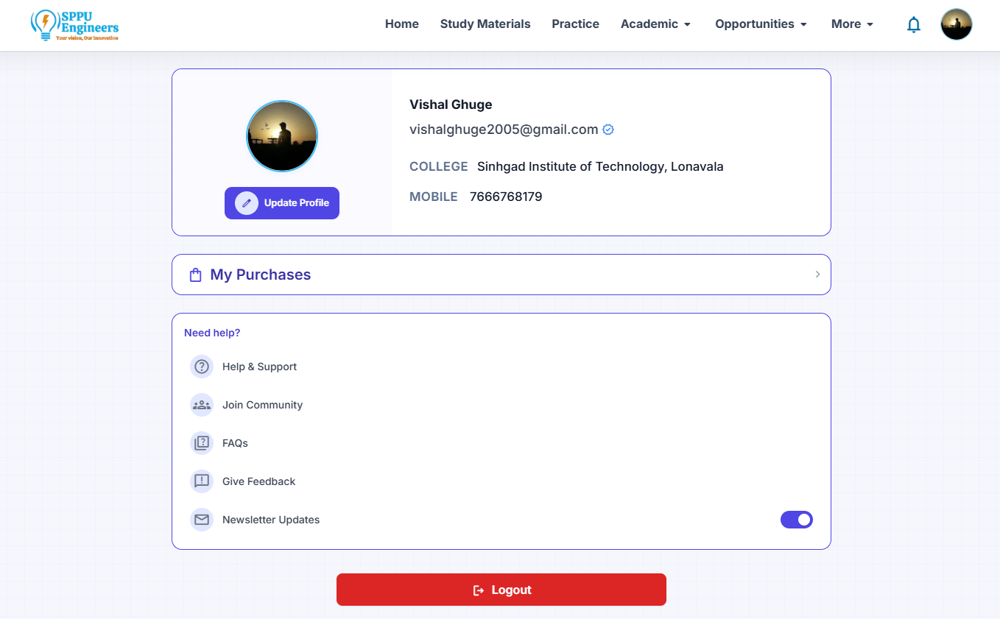

See your purchased packs, access status, and profile info. Access is updated in real-time after payment.

---

### 11. Admin Dashboard
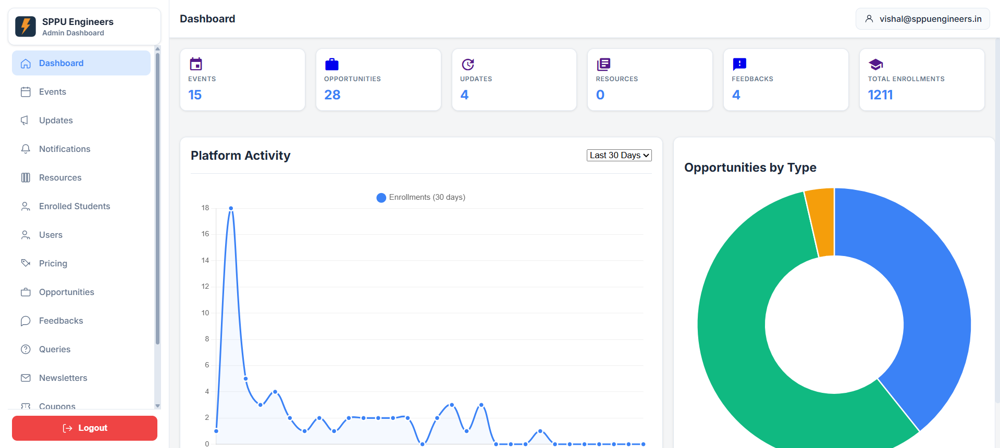

Admins can view all users, orders, stats, and manage content. Admin routes are protected by Firebase Authentication and Firestore role checks. All admin actions are logged for audit.

```js
// Backend: Admin route protection
router.use('/admin', firebaseAuth, async (req, res, next) => {
  const userDoc = await db.collection('users').doc(req.firebaseUser.uid).get();
  if (!userDoc.exists || userDoc.data().role !== 'admin') {
    return res.status(403).json({ error: 'Admin access required' });
  }
  next();
});
```

---

### 12. Tools & Calculators


Browse and use academic tools: SGPA/CGPA calculators, grade evaluators, and more. All tools are client-side and privacy-friendly.

---

### 13. Updates & Notifications
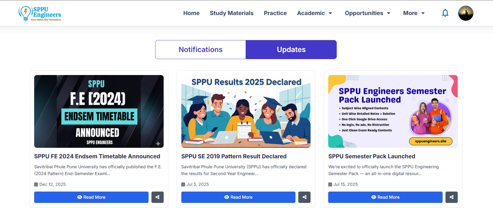

See the latest platform updates, new features, and important notifications. Users get real-time updates and can track all changes from one place.

---

### 14. Google Search Console Performance
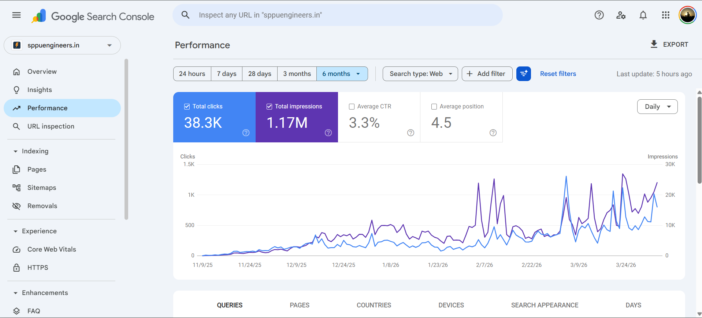

Official Google Search Console performance page for sppuengineers.in. Shows real search impressions, clicks, and SEO growth. This is not stored in Firestore — it's a direct screenshot from the official Google Search Console, reflecting the platform's real organic reach and authority.

---

## System Architecture

### Payment & Access Provisioning Flow

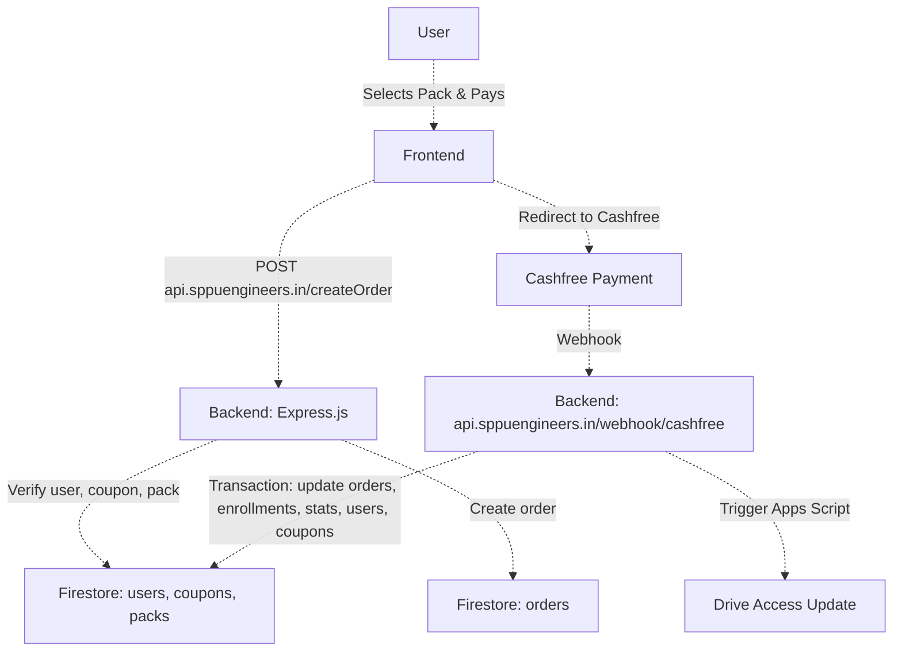

The platform processes real payments and manages access to paid academic resources through an automated backend pipeline. The payment flow separates order creation from payment verification. The backend creates an order record in Firestore, redirects to Cashfree, and waits for a webhook callback. On payment success, the webhook handler runs a Firestore transaction that updates multiple collections atomically (orders, enrollments, user stats, coupon usage). After database updates complete, a second webhook triggers Google Apps Script to provision Google Drive access. This separation ensures payment state consistency before external API calls.

**Key Design Decisions:**
- **Firestore transactions** ensure atomicity across collections (no partial updates)
- **Webhook idempotency** via status checks prevents duplicate processing
- **Apps Script decoupling** isolates Drive provisioning from payment logic
- **Order → Payment separation** supports retry logic and audit trails

**Example: Webhook Transaction Logic**

```js
// server/api/webhook.js (excerpt)
if (paymentStatus === "SUCCESS") {
  await db.runTransaction(async (tx) => {
    // ✅ ALL READS FIRST
    const paymentSnap = await tx.get(paymentRef);
    const enrollSnap = await tx.get(enrollRef);
    const existing = paymentSnap.exists ? paymentSnap.data() : {};
    // ...prepare data, check coupon, stats, etc.
    // ✅ NOW DO WRITES
    tx.set(paymentRef, paymentData, { merge: true });
    if (shouldCountCoupon) {
      tx.set(couponRef, { ...couponUpdate }, { merge: true });
    }
    if (!enrollSnap.exists) {
      tx.set(enrollRef, buildEnrollmentData(orderId, transactionId, paymentData, event), { merge: true });
    }
    if (!alreadyCounted) {
      tx.set(statsRef, { enrollments: admin.firestore.FieldValue.increment(1), updatedAt: admin.firestore.FieldValue.serverTimestamp() }, { merge: true });
    }
    if (existing.uid) {
      const userRef = db.collection("users").doc(existing.uid);
      tx.set(userRef, { hasActivePlan: true, lastPurchase: orderId, updatedAt: admin.firestore.FieldValue.serverTimestamp() }, { merge: true });
    }
  });
}
```

---

### Full Platform Architecture

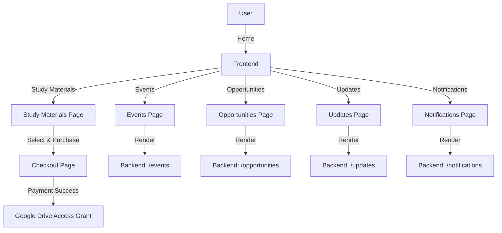

**System Layers:**

The platform uses a three-tier architecture with clear separation of concerns:

1. **Frontend Layer** (Vercel) — Static HTML/CSS/JavaScript served via CDN. Client-side Firebase Authentication. LocalStorage caching for performance. Direct Firestore reads for public data.

2. **Backend Layer** (Render) — Express.js API with Firebase Admin SDK. Protected routes with JWT verification. Payment webhook handlers. Admin operations and bulk updates.

3. **Database Layer** (Firestore) — NoSQL document store with real-time sync. Composite indexes for filtered queries. Security rules for client-side access. Transaction support for critical operations.

4. **Integration Layer** — Google Apps Script for Drive access automation. Cashfree for payment processing. ZeptoMail for welcome emails.

---

## Data Model

The system uses Firestore collections with denormalized structures optimized for read performance.

**Core Collections:**
- `users` → stores profile data, purchase history, access status, and role flags
- `orders` → immutable payment records with status tracking and metadata
- `enrollments` → maps users to purchased content with access timestamps
- `pricing` → defines semester packs with pricing, Drive folder IDs, and availability
- `opportunities` → job/internship listings with filters and application deadlines
- `coupons` → discount codes with usage limits and expiration logic

**Design Principles:**
- Each collection is structured to minimize reads through denormalization
- Composite indexes support filtered queries without full collection scans
- Status flags enable efficient webhook idempotency checks
- Timestamps use Firestore server timestamps for consistency

**Example Document Structure:**

```js
// users/{uid}
{
  email: "student@example.com",
  displayName: "Student Name",
  enrollments: ["sem3_2024", "sem4_2024"],
  role: "student",
  createdAt: Timestamp,
  stats: { totalOrders: 2, totalSpent: 698 }
}

// orders/{orderId}
{
  userId: "uid123",
  packId: "sem3_2024",
  amount: 349,
  status: "SUCCESS",
  paymentId: "cf_123",
  createdAt: Timestamp,
  processedAt: Timestamp
}
```

---

## Backend Architecture

**Core Responsibilities:**

1. **Payment Processing** — Validates pack availability and user eligibility. Creates Cashfree payment orders. Webhook requests are validated based on payment status and internal checks. Signature-based verification can be added as an additional security layer. Ensures idempotency through transaction-based status checks.

2. **Access Control** — Verifies Firebase ID tokens on protected routes. Enforces role-based access for admin operations. Maintains audit logs for sensitive actions. Triggers Google Apps Script for Drive provisioning.

3. **Data Management** — Runs Firestore transactions for multi-collection updates. Implements caching strategies for frequently accessed data. Handles coupon validation and usage tracking. Generates analytics for admin dashboard.

4. **Integration Orchestration** — Coordinates payment → database → access provisioning pipeline. Sends transactional emails via ZeptoMail. Updates user stats and platform-wide metrics. Manages error handling and retry logic.

**Authentication Flow:**

```js
export default async function firebaseAuth(req, res, next) {
  const authHeader = req.headers.authorization || '';
  const match = authHeader.match(/^Bearer (.+)$/);
  if (!match) return res.status(401).json({ error: 'Missing or invalid Authorization header' });
  const idToken = match[1];
  try {
    const decoded = await admin.auth().verifyIdToken(idToken);
    req.firebaseUser = decoded;
    next();
  } catch (err) {
    return res.status(401).json({ error: 'Invalid or expired Firebase ID token' });
  }
}
```

---

## Performance Optimizations

**1. Webhook Idempotency** — Transaction-based status checks before writes. Prevents duplicate payment processing and access grants. Flags in Firestore track processing state (e.g., `couponUsed`, `enrollmentCreated`).

**2. Atomic Updates** — Firestore transactions ensure all-or-nothing writes across collections. All reads happen before writes within transaction scope. Prevents race conditions during concurrent webhook calls.

**3. Client-Side Caching** — Opportunities data cached in localStorage (1-hour TTL). Reduces Firestore reads by ~70% for repeat visits. Cache invalidation on data mutations.

**4. Query Optimization** — All queries use composite indexes for filtered results. No unfiltered collection scans. Pagination limits read operations.

**5. Frontend Performance** — Skeleton loaders for perceived speed. Lazy image loading with IntersectionObserver. Critical CSS inlined, non-critical deferred.

**6. Admin Dashboard Efficiency** — Aggregated stats precomputed in dedicated collection. Real-time listeners limited to active sessions. Batch operations for bulk updates.

---

## Tech Stack

<table align="center">
  <tr><th>Frontend</th><th>Backend</th><th>Database</th><th>Integrations</th></tr>
  <tr align="center">
    <td>HTML, CSS, JavaScript<br/>Tailwind CSS</td>
    <td>Express.js<br/>Firebase Admin SDK</td>
    <td>Firestore<br/>Firebase Auth</td>
    <td>Cashfree<br/>Google Apps Script<br/>Google Drive API<br/>ZeptoMail</td>
  </tr>
</table>

---

## Engineering Approach

**Why Firebase + Firestore:** Real-time sync for instant UI updates without polling. Built-in authentication with JWT token verification. Security rules enable client-side reads without backend proxy. NoSQL structure fits denormalized, read-heavy workload. Scales automatically without manual database management.

**Why Cashfree:** UPI and card support required for Indian student payments. Webhook reliability critical for automated access provisioning. Lower transaction fees than alternatives for small ticket sizes.

**Why Google Apps Script:** Direct Drive API access without OAuth flows for each user. Runs in Google's infrastructure (low latency to Drive). Handles Drive permission management at scale. Free tier sufficient for current usage patterns.

**Tradeoffs Made:**
- **Firestore over SQL:** No joins or complex queries, but real-time sync and easier scaling
- **Apps Script over backend Drive API:** Less control, but simpler permission management
- **Denormalized data:** Higher storage cost, but much faster reads (acceptable for read-heavy app)
- **Client-side reads:** Security rules maintenance required, but eliminates backend proxy overhead

**What Could Be Improved:**
- Move to Cloud Functions for webhook handling (currently Express on Render)
- Add Redis caching layer for frequently accessed pack data
- Implement GraphQL for more efficient client-side data fetching
- Add Stripe for international payment support

---

## Deployment

- **Frontend:** Vercel (CDN, automatic HTTPS)
- **Backend:** Render (containerized Express.js)
- **Database:** Firebase (managed Firestore + Auth)
- **Email:** ZeptoMail (transactional email service)
- **Storage:** Google Drive (student access)

**Custom Domains:**
- `sppuengineers.in` → Vercel frontend
- `api.sppuengineers.in` → Render backend
- `auth.sppuengineers.in` → Firebase Auth

---

## Documentation

- [docs/architecture.md](docs/architecture.md): System structure and architecture diagrams
- [docs/modules.md](docs/modules.md): Detailed breakdown of all modules (frontend, backend, admin, integrations)
- [docs/data-flow.md](docs/data-flow.md): End-to-end process flows for all major features
- [docs/apps-script.md](docs/apps-script.md): Google Apps Script integration and automation
- [docs/scaling.md](docs/scaling.md): Scaling strategies and lessons learned

See the [docs/](docs/) folder for complete technical documentation.

---

**Built and maintained by Vishal Ghuge** | [GitHub](https://github.com/vishalghuge111) | [LinkedIn](https://linkedin.com/in/vishalghuge111)