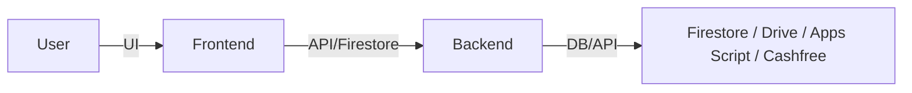
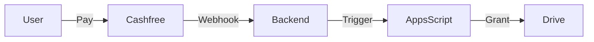
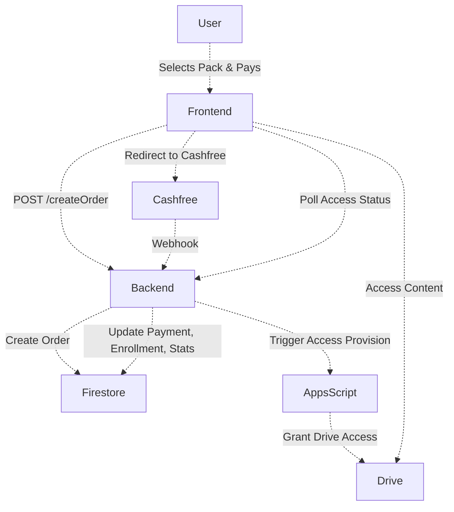

# Architecture

---

## Overview

SPPU Engineers is structured as a multi-layered web system:

- **Frontend**: HTML/JS (vanilla, no framework), Tailwind CSS, Firebase SDK
- **Backend**: Node.js (Express), REST API, Firestore admin
- **Data Layer**: Firestore (NoSQL), Google Drive, Google Sheets
- **External Services**: Cashfree (payments), Google Apps Script (automation)

No generic SaaS abstractions. All components are mapped to real code and workflows.

---

## System Layers

### Frontend
- Handles all user and admin UI
- Auth via Firebase Authentication (client SDK)
- Fetches data from Firestore (public collections) and backend APIs
- Manages localStorage cache for faster loads (opportunities, events)
- Triggers payments, shows access state, and renders content

### Backend
- Express.js API server
- Handles:
  - Payment webhooks (`/api/webhook/cashfree`)
  - Firestore transactions for orders, enrollments, stats, coupons
  - Duplicate prevention (idempotency in webhook)
  - Triggers Google Apps Script for Drive access
  - Admin APIs (user, content, stats, coupon management)
  - Order creation, coupon validation, and access checks
  - Role-based access for admin routes

### Data Layer
- Firestore: users, orders, enrollments, coupons, stats, events, opportunities
- Google Drive: all paid content, mapped by semester/branch/product
- Google Sheets: audit logs, access mapping, and manual overrides

### External Services
- Cashfree: payment gateway, order creation, webhook notifications
- Google Apps Script: automates Drive access after payment, prevents duplicate grants, logs all actions

---

## Diagrams

### 1. High-Level System

### 2. Payment Flow

---

## Backend Responsibilities

- Handle `/api/webhook/cashfree` for payment status
- Run Firestore transactions for atomic updates (orders, enrollments, stats, coupons, users)
- Prevent duplicate processing (idempotency via status checks)
- Trigger Apps Script for Drive access after payment
- Expose admin APIs for content, user, coupon, and stats management
- Validate coupons and create orders
- Enforce role-based access for admin endpoints

---

## Data Flow

- Frontend fetches public data directly from Firestore (events, opportunities, resources)
- Purchases and sensitive actions go through backend APIs
- Backend updates Firestore on payment, then triggers Apps Script for Drive access
- Access state is checked by reading Firestore and Drive permissions

---

## Module Coverage

- **Academic Content**: Study materials, notes, PYQs, mapped to Drive folders; access managed by Apps Script
- **Opportunities**: Internships, jobs, scholarships; fetched from Firestore, cached in localStorage
- **Payment System**: Order creation, Cashfree integration, webhook, Firestore updates, Drive access automation
- **Access Automation**: Apps Script grants/removes Drive access, logs all actions, prevents duplicates
- **Admin System**: Admin dashboard, protected by Firebase Auth and Firestore role, manages users, content, coupons, stats

---

## Performance Notes

- Webhook handler is idempotent (checks status before processing)
- Firestore transactions group all related writes (no partial updates)
- Frontend caches large lists (opportunities, events) in localStorage for speed
- Firestore queries use indexes and limits for efficiency

---

**Automation & Workflows:**
- Event-driven: All payment and access flows are asynchronous and idempotent
- Webhooks and triggers ensure reliable, atomic updates and external API calls
- Admin dashboard for content, user, and analytics management

---

## Payment & Access Provisioning Flow

---

## Key Design Principles

- **Layered architecture** for maintainability and scalability
- **Atomic transactions** for all payment and access updates
- **Webhook idempotency** to prevent duplicate processing
- **Separation of concerns** between payment, access, and content delivery
- **Role-based access control** for admin and user operations
- **Audit logging** for all critical actions
- **Cloud-native, serverless-first** approach for cost efficiency and reliability

---

## See Also

- [Data Flow](./data-flow.md)
- [Scaling](./scaling.md)
- [Apps Script Automation](./apps-script.md)
- [Modules](./modules.md)
