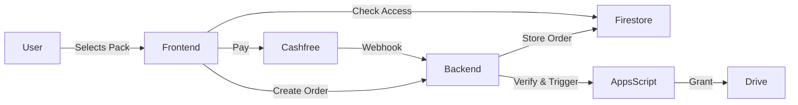

# Data Flow

This document explains how data and actions move through the SPPU Engineers system for key operations, step by step.

---

## 1. User Accessing Content (Read Flow)

1. User opens the site
2. Frontend fetches resource metadata from Firestore
3. Frontend checks if user has purchased access (Firestore + Auth)
4. If access exists, Drive links are shown
5. If not, content is shown as locked

---

## 2. Payment Flow (Core Flow)

1. User selects a semester pack
2. Frontend calls backend API to create an order
3. Backend stores order in Firestore
4. User completes payment on Cashfree
5. Cashfree sends webhook to backend
6. Backend verifies payment and runs Firestore transaction
7. Backend triggers Apps Script for access
8. Apps Script grants Drive access to user
9. Frontend checks updated access and unlocks content

---

## 3. Access Provisioning Flow

1. Backend sends POST request to Apps Script
2. Apps Script validates payload and order
3. Checks for duplicate access using order ID
4. Maps correct Drive folder using Google Sheet
5. Grants Drive access to user email
6. Logs action in Google Sheet

---

## 4. Opportunities Fetch Flow

1. Frontend checks localStorage for cached opportunities
2. If cache is valid, uses cached data
3. If not, fetches latest data from Firestore
4. Stores new data in localStorage
5. Renders opportunities in UI

---

## 5. Admin Flow

1. Admin logs in via Firebase Authentication
2. Frontend verifies admin role from Firestore
3. Admin performs actions (add/edit content, opportunities, coupons)
4. Backend updates Firestore collections
5. Changes are reflected in frontend after next fetch

---

## Payment Flow Diagram

---
